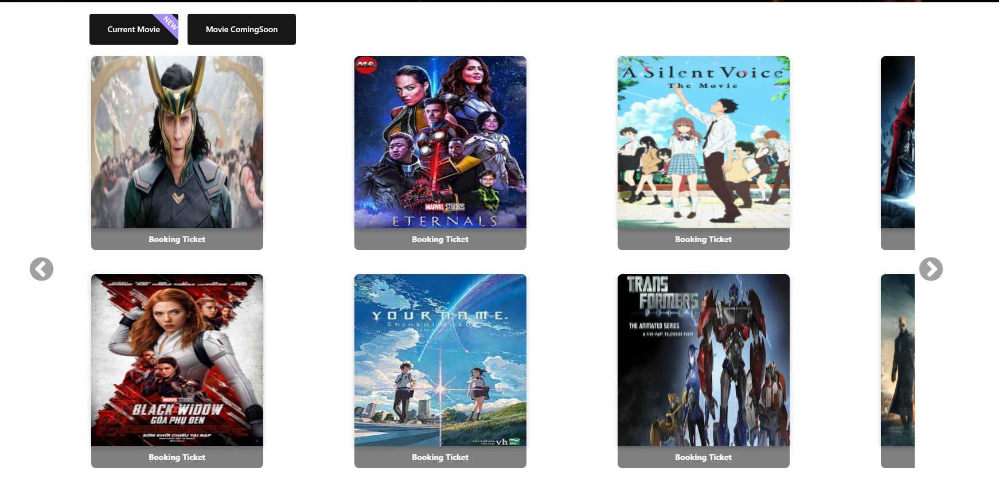

## The ReactJS project is one of two major projects graduating. It is a project about Booking movie tickets. It provides the basic functions and interfaces of a typical project such as:

** Client-side (Booking Ticket Page) **
 Component
 1. Carousel
 2. Search Bar
 3. News
 4. User Login Page
 5. Admin Page 
 6. Booking Ticket Page
 7. And Some other features will update in the future.

The project is organized as Components, each Component is a function, if you find your project is not needed with any functionality that the Project provides, you can completely remove that module without doing affect the operation of the source code.

